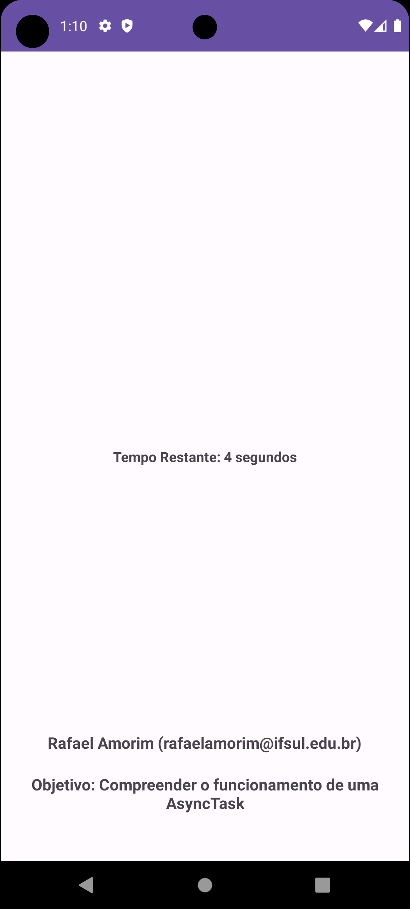

# Exemplo de uso do AsyncTask

Repositório criado para mostrar uma aplicação simples usando AsyncTask na disciplina de Desenvolvimento Mobile II, do curso de Tecnólogo em Analise e Desenvolvimento de Sistemas do Instituto Federal Sul Riograndense (IFSul), Campus Santana do Livramento

## Screenshot

## Sobre a Asynchronous Work

 - Acontece no momento.
 - Não precisa persistir após as reinicializações do  app ou do dispositivo.
 - Ocorre fora da linha de execução principal ou bloqueia a linha de execução principal.
 - Java: Threads
 - Kotlin: Corrotinas
 - Exemplo:
 -- App de mídia social para atualizar o feed de conteúdo